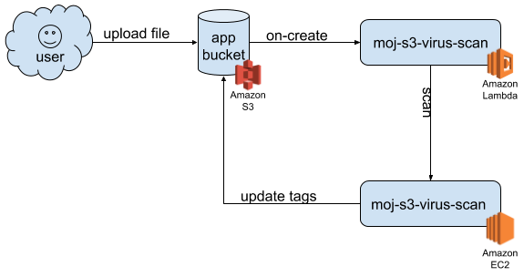

# MoJ S3 Virus Scanner

A service to scan viruses automatically in S3 buckets.

This project is a service to provide automatic virus scanning for files in AWS
S3 buckets. The intended way to use this service is via an event attached to an
S3 bucket which calls a Lambda function, which in turn makes an HTTP request to
an instance of this application which then performs the scan and updates tags on
the file in S3 to indicate whether it has passed or failed the virus scan.



When a file is uploaded to an S3 bucket, a on-create event is triggered and runs
a lambda function which begins the virus scan on the newly created file. Once
the file is scanned it is tagged according to whether it passed the scan or not,
and these tags can be used to determine whether the file is safe to present to
the user or not.

This approach is an adaptation of the [bucket-antivirus-function approach
presented by Upside Travel]
(https://github.com/upsidetravel/bucket-antivirus-function), but allows the
scanning to be performed much more quickly (1s-2s vs 10s-20s). It is
particularly well suited to use with services that do direct uploads to S3, e.g.
using Dropzone, but works equally well with any service that needs virus scanning.

## Running ##

### Locally ###

#### Installing Dependencies ####

##### Ruby #####

This is a Sinatra app so requires Ruby, which can be installed on OSX machines
with brew. Visit [their site](https://brew.sh) for installation instructions.

This project uses a `.ruby-version` to specify which version of Ruby to install.
This can be done easily with `rbenv` and `ruby-build`:

```
brew install rbenv ruby-build
```

Now you are ready to install ruby and the required gems:

```
rbenv install
gem install bundler
```

##### ClamAV #####

As this app is a virus scanner, you'll also need to install ClamAV:

```
brew install clamav
```

#### Starting the Application Locally ####

Start the app like this:

```
bundle exec ruby ./moj-s3-virus-scan.rb
```

And then you can test with curl:

```
curl http://localhost:4567/scan?bucket=your-bucket-name&key=some/file.pdf
```

### Locally with Minikube

#### Installing and Starting Up ####

Install [Minikube](https://github.com/kubernetes/minikube) and
[kubectl](https://kubernetes.io/docs/reference/kubectl/kubectl/).

```
brew cask install minikube
brew install kubernetes-cli
```

Build the Docker image. We want to make sure that the image is available to
Minikube so to avoid having to use an external registry we build it using the
Docker instance used by Minikube, which means we have to start it up and import
the docker environment settings into the currently running shell.

```
# Start up Minikube. See 'minikude help' for more help.
minikube start

# Import Minikube's Docker environment into the current shell. This only
# affects the current shell so will need to be repeated from any other shell
# you want to build the Docker image in.
eval $(minikube docker-env)

# Build the image within Minikube's Docker env.
docker build . -t moj-s3-virus-scan:latest

# It may be convenient to see what's running in the cluster using the Minikube
# dashboard, use the following command to open it up in your browser.
minikube dashboard
```

For the app to authenticate correctly to access the buckets it'll be scanning
files in, credentials need to be provided via K8s secrets. Create the secret and
edit it in your preferred editor (tip: this will defualt to `vi` unless you set
your `EDITOR` environment variable, e.g. `atom`, `mate`, `subl` ... ... `emacs`).

```
kubectl create secret generic buckets
kubectl edit secret buckets
```

#### Creating the Buckets Secret ####

The data section of the secret is a key-value pairing of a bucket name and short
YAML snippet with the credentials including values for `aws_access_key_id` and
`aws_secret_access_key`, base64 encoded. See the [k8s page on
secrets](https://kubernetes.io/docs/concepts/configuration/secret/) for more
info on secrets. We do not include bucket details and credentials here as this
is a public repo, so you'll need to prepare which bucket you need access to and
what credentials to use for them separately. Once you have them, you can create
them by adding them to the `stringData` section.

```
stringData:
  your-bucket-name.yml: |-
    aws_access_key_id: ACCESS_KEY_ID
    aws_secret_access_key: AWS_SECRET_ACCESS_KEY
```

Place this at the end of the secrets file. Multiple buckets may be added. Once
created, this secret will exist in the k8s namespace util it is destroyed, and
can be retrieved from the cli or the dashboard, so please take appropriate
precautions.

#### Creating the Deploy ####

Once the Docker image is created it can be deployed to the Minikube cluster like
so:

```
kubectl create -f kubectl_deploy/local/deployment.yml
```

This will create all the resources necessary, including the pods, to start up
the application in Minikube. You'll still need make accessible from outside the
Minikube environment, this can be done with the `expose` command:

```
kubectl expose deployment moj-s3-virus-scan --type=NodePort
```

Once done, you can access the service with the commands:

```
# List the services and their exposed URL, if any.
minikube service list

# Open up our app in your browser:
minikube service moj-s3-virus-scan
```

Now you should be able to test scanning using curl:

```
curl http://192.168.99.100:32424/scan?bucket=your-bucket-name&key=some/file.pdf
```

#### Removing / Re-deploying ####

There may be a better way to do this, but for now this can be accomplished by
deleting and recreating the deploy:

```
kubectl delete deployment moj-s3-virus-scan
kubectl create -f kubectl_deploy/local/deployment.yml
```

Don't forget to re-build the Docker container if you make any changes to the app.

## Configuring the Live App ##

### Scanning Application ###

The scanning is preformed by the application in this repository which provides
the endpoint `/scan` to perform the scan. It takes the request params `bucket`
and `key` to specify which object to scan and requires permissions to access the
bucket provided.

### Lambda Function ###

To perform the scan a lambda function must be created as a bit of glue between
the S3 bucket and the scanning application. The steps to create this are:

### Creation ###

1. Go to the Lambda section in the Amazon console.
2. Create a new function:
   * Select "Author from scratch"
   * Give the function name e.g. moj-s3-virus-scan
   * Select a Python 3.x runtime
   * Select "Create new role from template"
   * Give the role a name, e.g. moj-s3-virus-scan-role
   * Select the policy template "Amazon S3 object read-only permissions"
3. Once created, select the function in the Designer to modify it.
4. Ensure in the Function Code section the option "Edit code inline" is selected.
5. Paste in the following code:
```
import urllib.parse as urlparse
import json

def lambda_handler(event, context):
    for record in event["Records"]:
        key    = record["s3"]["object"]["key"]
        bucket = record["s3"]["bucket"]["name"]
        url    = "https://moj-s3-virus-scan.dsd.io/scan?" + urlparse.urlencode({"key": key, "bucket": bucket})
        print("url: " + url)
        http.client.HTTPConnection.request("GET", url)
    return {
        'statusCode': 200,
        'body': json.dumps('OK')
    }
```
6. Increase the timeout on the "Basic Settings" to 30s.
7. Click on "Save" to save the function.

This function will need to be used with the `on-create` event to work, see the
section on configuring the S3 bucket.

### S3 Bucket ###

### Event Hook Configuration ###

To trigger the scan an event hook needs to be added to the S3 bucket where the
files-to-be-scanned are created. Navigate to the bucket in the S3 console and then:

1. Click on "Properties".
2. Click on "Events".
3. Click on "Add Notification".
4. Give the notification a name, e.g. `moj-s3-virus-scan`
5. Select "All object create events".
6. Select "Lambda Function" in the "Send To" option.
7. Select the lambda function that was created previously, e.g. `moj-s3-virus-scan`.

Note: any bucket that uses this service will need to give permissions to the
application to read object and to tag them.
